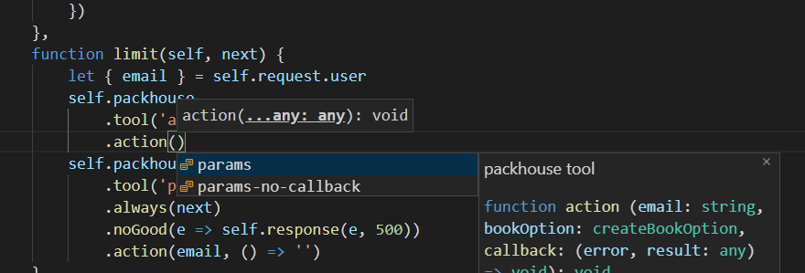

# Packhouse

這是[Packhouse](https://github.com/KHC-ZhiHao/Packhouse)的擴展。

### 功能

主要是加強引用關聯，補足TS Type沒辦法對應的功能：

#### 自動找尋Group


#### 自動建構參數



#### Hover訊息


### 使用條件

該擴展的觸發機制是判斷有無.packhouse的資料夾，內部的資料必須藉由Packhouse CLI來建構，因此你可能需要：

```bash
npm install packhouse-cli -g
```

在你的Packhouse專案中的`packhouse.json`加入以下這段：

> `--main`的對象主要是Packhouse.Main() export 的檔案。

```json
{
    "script": {
        "read": "packhouse read --watch --main ./src/main.js",
        // typescript請使用以下這段
        "read-ts": "packhouse read --ts --watch --main ./src/main.ts"
    }
}
```

並且運行：

```bash
npm run read

or

npm run read-ts
```

此時你應該能發現`.packhouse`已經被建立，如果擴展沒有被觸發，可以考慮重整VScode。

> 當`--watch`時會在你修改檔案時重新建構`.packhouse`的結構，此時擴展也會同步更新，因此建議在開發時保持啟動。

### 常用Snippets

#### handler.tool

```js
self.tool()
    .noGood(self.error)
```

#### handler.line

```js
self.line()()
    .action(self.access())
```

#### step

```js
function name(self, next) {
    // ...do something
}
```

#### step.tool

```js
function name(self, next) {
    self.tool()
        .always(next)
        .noGood(e => self.response(e, 500))
    }
}
```